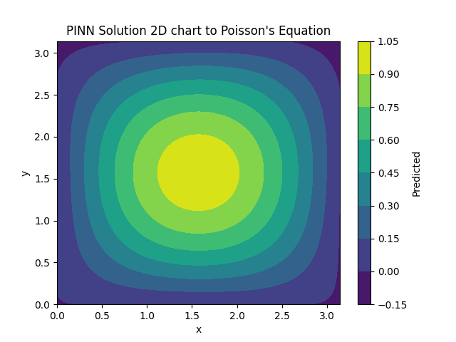
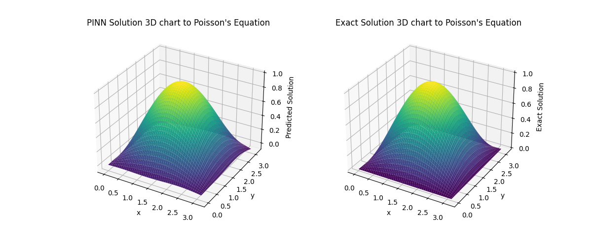

# Physics-Informed Neural Network (PINN) for Solving Poisson's Equation

## Overview
This project demonstrates how to solve Poisson's equation using a **Physics-Informed Neural Network (PINN)**. The PINN is a deep learning model that incorporates the physical law (Poisson's equation) into the training process by penalizing the violation of the governing equations during model optimization.

Poisson's equation is a fundamental partial differential equation (PDE) used in various fields such as physics and engineering. In this example, we use a PINN to solve the 2D Poisson's equation:

\[
\frac{\partial^2 u}{\partial x^2} + \frac{\partial^2 u}{\partial y^2} = f(x, y)
\]

Where \(f(x, y) = -2 \sin(x) \sin(y)\) and the exact solution is \(u(x, y) = \sin(x) \sin(y)\).

---

## Key Components

### 1. Poisson's Equation
The equation to be solved is:
\[
u_{xx} + u_{yy} = f(x, y)
\]
where \( f(x, y) = -2 \sin(x) \sin(y) \) is the source term, and \( u(x, y) = \sin(x) \sin(y) \) is the exact solution.

### 2. PINN Model
The PINN is implemented as a neural network with the following architecture:
- **Input Layer**: Takes two input features \( x \) and \( y \), representing spatial coordinates.
- **Hidden Layers**: The network consists of 5 hidden layers, each with 400 neurons and \( \tanh \) activation functions. Dropout layers with a rate of 0.1 are added to reduce overfitting.
- **Output Layer**: A single scalar output representing the solution \( u(x, y) \) at the input point.

The model is trained to minimize the residual of the Poisson equation and the boundary condition.

### 3. Loss Function
The loss function includes:
- **Poisson Residual**: The difference between the Laplacian of the predicted solution and the true source term.
- **Boundary Residual**: The difference between the predicted solution and the exact solution at the boundary of the domain.

The final loss is a weighted sum of these two residuals.

### 4. Training Process
- The model is trained using **Adam optimizer** with a learning rate of 0.001.
- The training loop includes dynamic generation of random points, with additional points added every 100 epochs.
- Gradient norms (max and L2) are monitored during training for diagnostic purposes.

### 5. Visualization
After training, the model's predicted solution is compared to the exact solution through:
- **Contour plots**: 2D visualization of the predicted and exact solutions.
- 
- 
- **3D Surface Plots**: 3D visualization of the predicted and exact solutions.
- 
- **Error Visualization**: The error between the predicted and exact solutions is calculated and displayed.
- 
- 

### 6. Error Metrics
The maximum error between the predicted and exact solutions is printed after training, providing a measure of the model's performance.

---


## Requirements

To run this code, you will need:
- Python 3.x
- PyTorch
- NumPy
- Matplotlib

Install the required libraries using pip:
```bash
pip install torch numpy matplotlib
